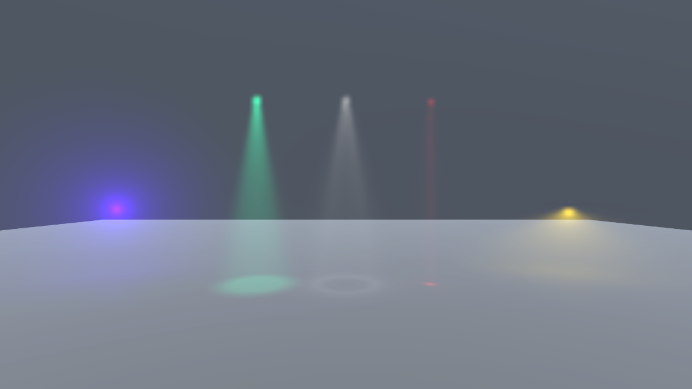
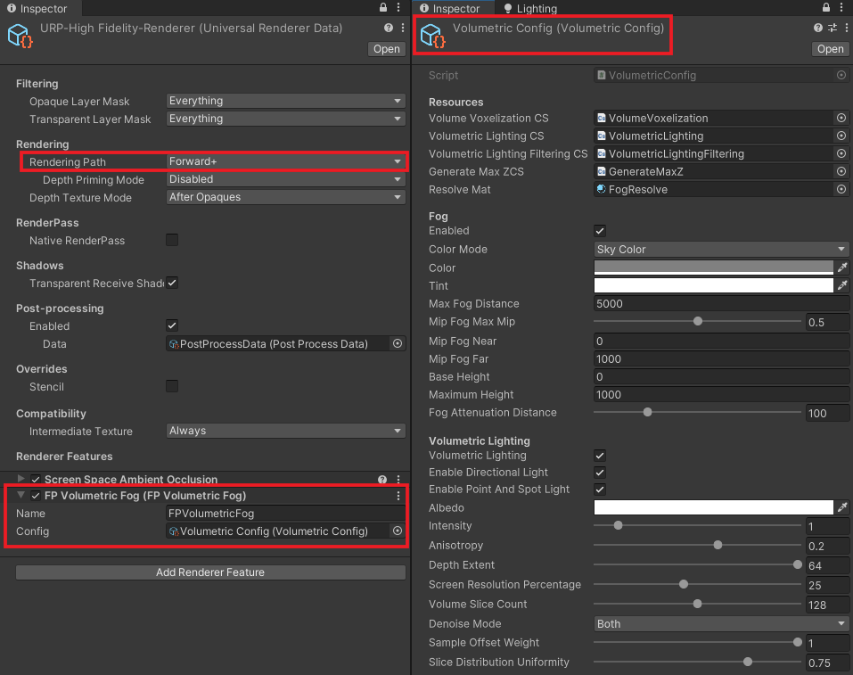

# Universal Forward+ Volumetric Fog (Global)

 

This repository is copied from Unity HDRP Volumetric Fog.

Note that this feature is working as a global fog volume. So you can't place local fog volumes while HDRP requires them.

This feature is available on URP Forward+ from 2022.3.0f1 (2022 LTS) version.

---

## How to Use
1. Add 'FP Volumetric Fog' renderer feature to Renderer data (Make sure to use Forward+)
2. Create 'Volumetric Config' via 'Create/UniversalVolumetric/VolumetricFogConfig'
3. Link the config asset to the renderer feature

 

---

## Limitations
1. XR not supported
2. Additional Directional & Local(point & spot) lights are only available in Forward+
   
   (In other words, only MainLight is working for Forward)
   
3. Additional light shadows are not supported due to performance
4. DiffuseGI not contributes to lighting
5. Noise texture is not supported 
