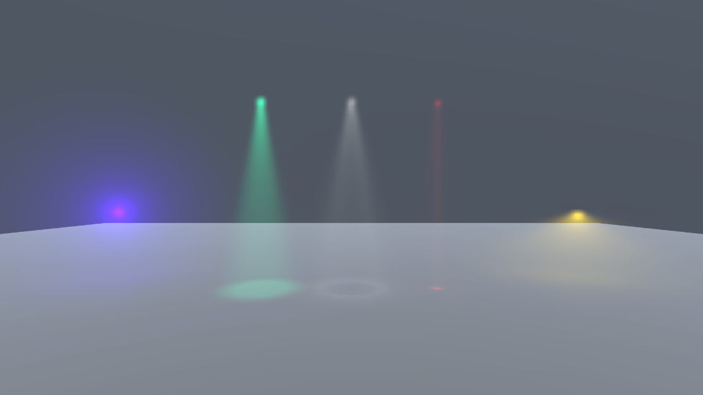
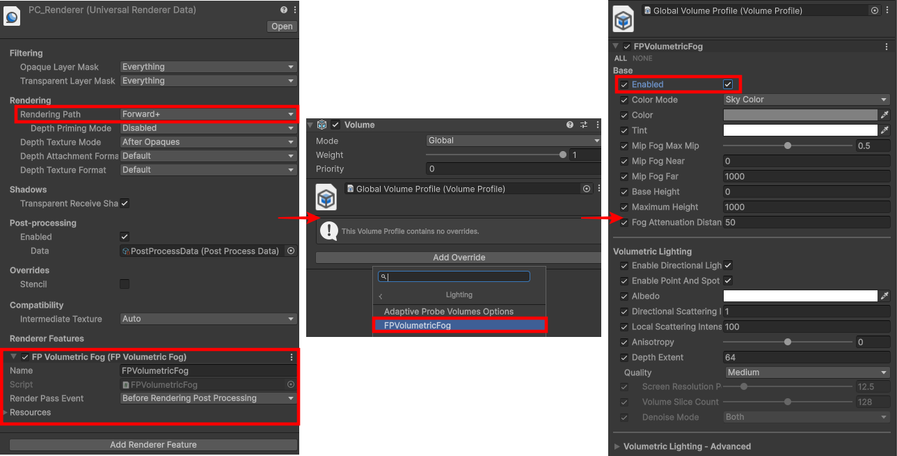
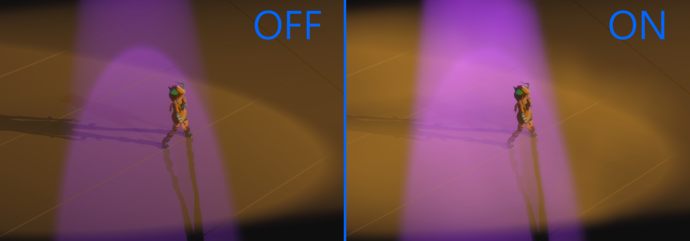
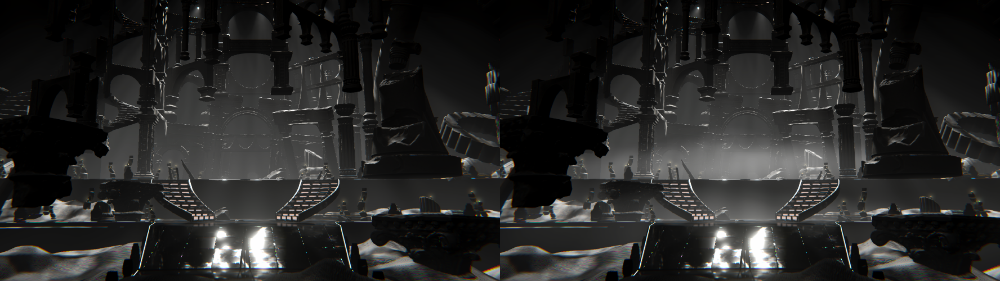
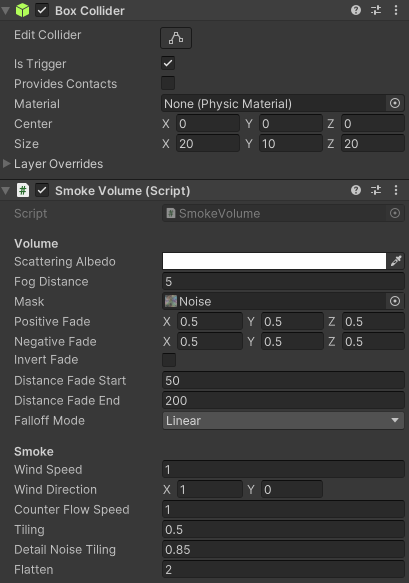

# Universal Forward+ Volumetric Fog (Global)

 

This repository is copied from Unity HDRP Volumetric Fog.

This package is controlled through a Global Volume override while HDRP requires its own fog volume workflow.

This package is available on URP Forward+ from 2022.3.0f1 (2022 LTS) version.

||2022 LTS|2023|Unity 6|
|:---:|:---:|:---:|:---:|
|URP Compatibility|O|O|O|
|RenderGraph Implementation|X|X|O|

## How to Use
1. Add `FPVolumetricFog` renderer feature to Renderer data (Make sure to use Forward+).
2. Add a `Global Volume` to the scene and create or assign a Volume Profile.
3. Add the `Lighting/FPVolumetricFog` override to that profile.
4. Enable the Enabled override and tune the fog from the Volume component.

### Migration
Existing Volumetric Config assets are kept only as deprecated references so you can manually copy their values into the Volume override.

### NOTE
If you use Unity 6 LTS and the rendering result is not as expected, change `Shader Precision Model` setting in `Project Settings > Player > Other Settings > Shader Settings`.

 

## Smoke Volume
While this package assumes a global volume, you can put a local smoke volume to make a ground smoke effect for a specific area. Smoke volume component uses a box collider to determine its area. Due to performance, it supports 4 smoke volumes at maximum.

To add a smoke volume to your scene, create a new gameObject and add 'Smoke Volume' component to the gameObject. You might need to create your own noise texture to use, but I added a default noise texture which can be found at 'Runtime/Textures/' directory.

## Limitations
1. XR not supported
2. Additional Directional & Local(point & spot) lights are only available in Forward+
   
   (In other words, only MainLight is working for Forward)
   
3. DiffuseGI does not contribute to lighting
4. Noise texture is not supported 
5. The number of LocalSmokeVolume is 4 at maximum.
