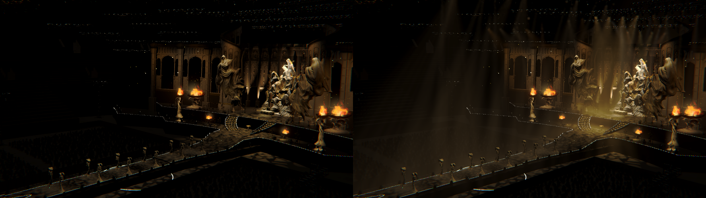
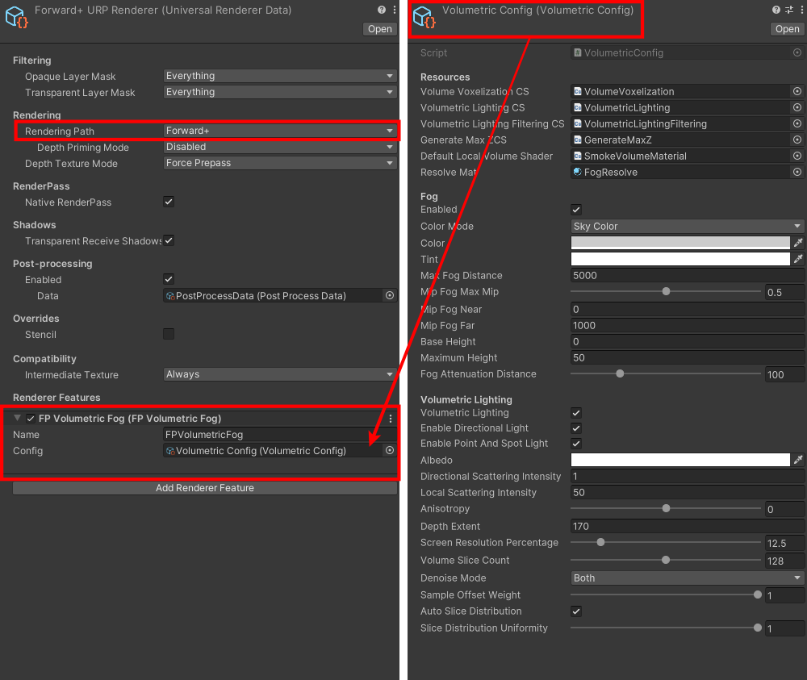

# Universal Forward+ Volumetric Fog (Global)

 

This repository is copied from Unity HDRP Volumetric Fog.

Note that this feature is working as a global fog volume while HDRP requires local volumes.

This feature is available on URP Forward+ from 2022.3.0f1 (2022 LTS) version.

## How to Use
1. Add 'FP Volumetric Fog' renderer feature to Renderer data (Make sure to use Forward+)
2. Create 'Volumetric Config' via 'Create/UniversalVolumetric/VolumetricFogConfig'
3. Link the config asset to the renderer feature

 

## Smoke Volume
While this feature assumes a global volume, you can put a local smoke volume to make a ground smoke effect for a specific area. Due to performance, it supports 4 smoke volumes at maximum.

To add a smoke volume to your scene, create a new gameObject and add 'Smoke Volume' component to the gameObject. You might need to create your own noise texture to use, but I added a default noise texture which can be found at 'Runtime/Textures/' directory.

 

## Limitations
1. XR not supported
2. Additional Directional & Local(point & spot) lights are only available in Forward+
   
   (In other words, only MainLight is working for Forward)
   
3. DiffuseGI not contributes to lighting
4. Noise texture is not supported 
